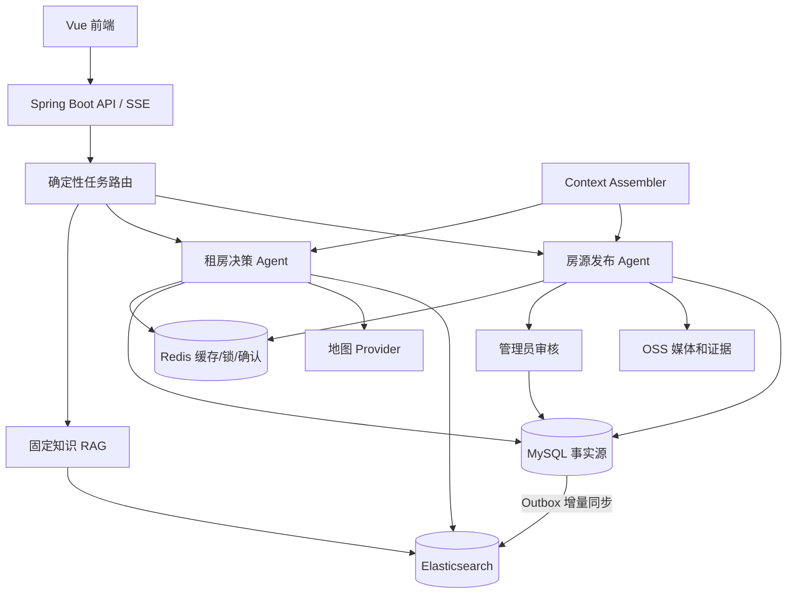
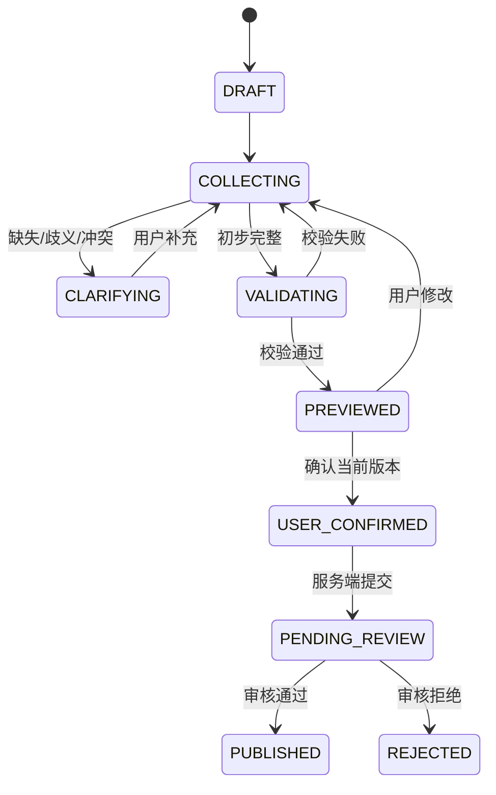
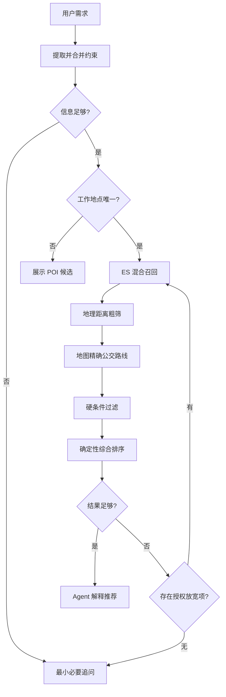
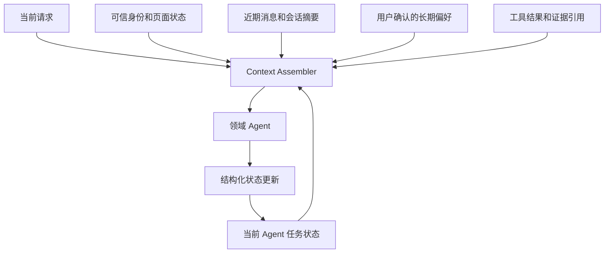

# 房屋租赁平台 Agent 系统完整优化改造方案

> 文档版本：v1.0  
> 编制日期：2026-07-26  
> 适用项目：`D:\\mywork\\housing-rental-platform-java`  
> 当前基线：Java 17、Spring Boot 4.0.7、Spring AI 2.0.0、MyBatis、MySQL、Redis、Chroma、Vue 3  
> 文档性质：目标架构、实施方案与验收规范，不代表全部能力已经实现

## 1. 文档目的

本文档根据当前项目代码、`docs/AI_AGENT_UPGRADE_PLAN.md`、测试数据库结构、前后端页面以及 `COMMUTE_MAP_INTEGRATION_PLAN.md` 编制，用于指导项目从“AI 客服 + 混合 RAG + 单 Agent”升级为“房源标准化发布 + 通勤约束找房 + 双领域 Agent”的完整系统。

最终需要可靠处理两类任务：

1. 租客输入“我在某某公司上班，平时地铁通勤，希望通勤不超过 X 分钟，再加预算、户型、面积、楼层、电梯和设施等条件”，系统完成地点消歧、混合检索、真实路线计算、硬条件过滤和可解释推荐。
2. 房东使用自然语言描述房源，系统提取结构化字段、发现缺失和歧义、核验身份与发布资格、生成预览，经用户确认后提交审核，审核通过后自动进入搜索索引。

文档中的每个主要部分都给出当前问题、修改原因、修改意义、实现方案和验收标准。

## 2. 当前基线与总体结论

### 2.1 当前已实现能力

当前项目已经具备：

- 用户、房东、房源、审核、聊天、通知、收藏、支付和上传等基础业务；
- JWT 鉴权和角色权限；
- 确定性意图路由与模型意图识别；
- MySQL 价格、区域和户型硬过滤；
- Chroma 房源及 FAQ 向量检索；
- Spring AI Tool Calling；
- 单 Agent 多步搜索、详情和比较；
- 收藏、联系房东的一次性确认令牌；
- SSE 状态、工具轨迹、心跳、取消和错误事件；
- 模型、向量库或 Redis 不可用时的安全降级；
- H2 隔离测试和较完整的接口、安全、Agent 工具测试。

2026-07-26 实际执行后端测试：

```text
Tests run: 96, Failures: 0, Errors: 0, Skipped: 0
BUILD SUCCESS
```

### 2.2 当前项目的准确定位

当前架构是：

> 确定性路由 + 混合 RAG + 局部单 Agent Tool Calling。

它已经具有 Agent 特征，但大部分找房请求仍进入预设链路，上下文也只支持较短的续聊，因此尚不是完整的任务型 Agent 系统。

### 2.3 改造后的定位

改造后的目标定位是：

> 以 MySQL 事实数据、Elasticsearch 混合检索和地图路线服务为可信能力，以确定性路由连接“房源发布 Agent”和“租房决策 Agent”，同时保留固定知识 RAG 的智能租房决策平台。

这不是 Agent 群，而是一个路由器、两个领域 Agent、一个知识 RAG 工作流和一组普通业务工具。

### 2.4 总体改造清单

| 领域 | 当前情况 | 目标情况 | 优先级 |
| --- | --- | --- | --- |
| 房源数据 | 字段少、描述模糊 | 详细结构化字段、证据、验证状态 | P0 |
| 房源检索 | Chroma + MySQL 简单组合 | ES 全文、过滤、地理、向量混合召回 | P0 |
| 索引同步 | 管理员手动全量同步 | Outbox 增量同步、对账、版本索引 | P0 |
| 通勤能力 | 无真实 POI 和公交路线 | POI 消歧、地理编码、通勤硬过滤 | P0 |
| 上下文 | 最近 10 条消息和四字段快照 | 会话、任务、草稿、偏好、证据分层 | P0 |
| Agent | 单 Agent 处理局部任务 | 发布 Agent + 租房决策 Agent | P1 |
| 发布流程 | 固定表单直接提交审核 | AI 补全、冲突检测、预览、确认 | P1 |
| RAG | 7 条 FAQ、固定阈值 | 可维护知识库、引用、拒答、评测 | P1 |
| 排序 | 简单向量分与偏好分 | 硬过滤、通勤计算、确定性综合排序 | P1 |
| 前端 | 基础表单和 AI 聊天 | POI 候选、约束面板、草稿预览、路线卡片 | P1 |
| 评测 | 缺少检索基准 | 检索、发布、Agent、通勤专项评测集 | P0 |

**本部分修改原因：** 当前能力分散且边界容易被“用了 AI”掩盖，需要先明确哪些是现状、哪些是目标。

**本部分修改意义：** 后续实施、答辩和面试可以用同一套口径，不会把计划能力误报成已实现能力。

## 3. 当前问题诊断

### 3.1 房源信息不足

当前房源主要包含标题、描述、价格、面积、室厅卫厨、租赁方式、区域、地址和单张封面图。缺少楼层、电梯、朝向、阳台、起租日、租期、费用承担、宠物政策、详细家电、坐标和验证状态。

这会导致：

- 用户提出的条件在数据库中没有对应字段；
- “家电齐全”“近地铁”“随时入住”等营销描述无法精确判断；
- AI 只能猜测或忽略条件；
- 向量库无法召回原本未记录的事实；
- 推荐解释缺乏证据。

### 3.2 当前检索链路存在截断和假命中风险

当前每套房源生成标题、价格户型、地区地址、描述四个向量文档，房源检索固定使用阈值 `0.5`。

关键问题：

1. 有结构化约束时不使用向量 ID 限制候选，MySQL 无相关排序直接 `LIMIT 50`。
2. 正确房源可能在第 50 条之后被提前截断。
3. 纯语义查询向量零命中时，空 ID 会使 SQL 退化为任意公开房源，造成假命中。
4. 多片段只保留首次分数，缺少字段级分数融合。
5. 单一相似度阈值不能适应短关键词、长需求、地区名和设施名。
6. 没有可执行的人工标注检索基准，无法量化召回率和排序质量。

### 3.3 索引一致性不足

当前索引主要通过管理员接口全量删除和重建，房源创建、修改、审核、下架、删除后没有可靠的自动增量同步。

项目还曾观察到 Docker Chroma 命名卷与本地 `.runtime/chroma` 数据目录不同、活跃 collection 为空。每套环境都必须以 API 和监控验证，不能只看本地文件。

### 3.4 Agent 动态性不足

当前 Agent 能调用搜索、详情、比较、知识、收藏预览和联系房东预览工具，但尚无：

- 房源发布 Agent；
- 工作地点 POI 消歧；
- 真实公交路线工具；
- 独立任务状态与阶段；
- 缺失、歧义、冲突驱动的动态追问；
- 经用户授权的条件放宽与重新检索。

### 3.5 上下文仅适合短期续聊

当前读取最近 10 条消息，维护 `currentHouseId`、`candidateHouseIds`、`searchConstraints`、`lastIntent`，并将快照附着到助手消息 metadata。

该设计能处理“第二套怎么样”，但不能可靠支撑长发布流程和长期找房：

- 会话与业务任务没有分离；
- 发布与找房可能串线；
- 无任务阶段、草稿版本、待补字段、冲突字段和 POI；
- 无乐观锁，并发请求可能覆盖状态；
- 长期偏好与本次临时条件未分离；
- 权威状态、用户原话和工具证据缺少可信分区。

### 3.6 缺少真实通勤事实

当前房源没有标准经纬度、地图 POI ID、地理编码状态和公交路线服务。“离地铁近”不能证明“到公司 35 分钟以内”，向量检索也无法计算真实换乘。

### 3.7 评测不足

现有 96 个测试对业务正确性和安全有良好覆盖，但缺少以下基准：

- 房源召回 Recall@K、MRR、nDCG；
- 硬条件违反率；
- 地点消歧正确率；
- 发布字段提取和追问完整率；
- Agent 任务完成率、工具选择正确率；
- 无答案拒答和事实一致性。

**本部分修改原因：** 召回率低不是单一数据库问题，而是数据、索引、候选、状态和评测共同造成的。

**本部分修改意义：** 明确根因后，避免仅替换向量数据库或增加提示词，却没有改善最终推荐。

## 4. 目标架构与边界



### 4.1 组件职责

| 组件 | 权威职责 | 明确不负责 |
| --- | --- | --- |
| MySQL | 房源、草稿、任务、审核、确认、用户事实 | 语义相似搜索 |
| Elasticsearch | 全文、结构化、向量、地理候选召回 | 最终业务事实 |
| 地图服务 | POI、坐标、步行和公交路线 | 房源价格与状态 |
| Redis | 路线缓存、锁、限流、短期确认 | 永久任务状态 |
| 发布 Agent | 补全、消歧、决定下一步问题 | 审核通过、直接公开 |
| 租房决策 Agent | 理解需求、选择工具、解释结果 | SQL、路线计算、权限判断 |
| 知识 RAG | 有来源的合同和租房知识 | 房源精确筛选 |
| 排序服务 | 硬过滤、分数计算、稳定排序 | 自由生成事实 |

### 4.2 路由原则

路由优先使用可信信息：页面入口、用户角色、`taskId`、任务类型和阶段，最后才使用模型或规则识别自然语言。

| 路由 | 场景 | 执行方式 |
| --- | --- | --- |
| `PUBLISHING_AGENT` | 新建、补充、预览、确认草稿 | 动态 Agent |
| `RENTAL_DECISION_AGENT` | 通勤找房、比较、修改条件 | 动态 Agent |
| `KNOWLEDGE_RAG` | 押金、合同、退租 | 固定工作流 |
| `GENERAL_CHAT` | 问候和能力说明 | 固定回答或单模型 |
| `DIRECT_BUSINESS_API` | 列表、详情、审核 | 普通接口 |

### 4.3 为什么只拆两个 Agent

发布与找房的目标、状态、提示词、工具和权限明显不同，拆成两个领域 Agent 合理。地图、检索、排序、权限和审核具有稳定输入输出，应保持普通服务。继续拆成 POI Agent、路线 Agent、排序 Agent、审核 Agent 会增加模型成本、状态同步、错误传播和调试难度。

### 4.4 不做的事情

- 不自建完整地铁拓扑替代地图服务商。
- 不让模型生成并直接执行 SQL、ES DSL、URL 或密钥。
- 不让 AI 自动审核或直接发布。
- 不让 Agent 擅自放宽硬条件。
- 不把向量库作为业务状态数据库。
- 不为展示“多 Agent”而拆分确定性服务。

**本部分修改原因：** Agent 与普通服务边界不清会导致系统不可控、昂贵且难测试。

**本部分修改意义：** 两个领域 Agent 提供真正的动态性，确定性服务继续提供安全和可验证性。

## 5. 房源数据模型升级

### 5.1 数据分层

1. **核心结构化事实**：价格、面积、户型、楼层、电梯、费用、租期。
2. **可重复配置事实**：家电、家具、房间、数量、品牌、能耗。
3. **系统计算事实**：坐标、附近地铁、步行距离、通勤路线。
4. **主观语义描述**：采光感受、安静程度、装修风格。

### 5.2 `house` 主表目标字段

| 分类 | 字段 | 类型建议 | 必填 | 说明 |
| --- | --- | --- | --- | --- |
| 展示 | `title` | VARCHAR(200) | 是 | 标准标题 |
| 展示 | `description` | TEXT | 否 | 主观补充描述 |
| 租赁 | `rent_amount` | DECIMAL(10,2) | 是 | 可兼容当前 `price` |
| 租赁 | `deposit_months` | TINYINT | 是 | 押金月数 |
| 租赁 | `payment_cycle_months` | TINYINT | 是 | 付款周期 |
| 租赁 | `minimum_lease_months` | SMALLINT | 是 | 最短租期 |
| 租赁 | `available_from` | DATE | 是 | 最早起租日 |
| 租赁 | `rental_mode` | VARCHAR(20) | 是 | 整租/合租 |
| 租赁 | `short_rent_allowed` | BOOLEAN | 是 | 是否短租 |
| 租赁 | `pets_allowed` | BOOLEAN | 否 | 未知可为空 |
| 租赁 | `sublet_allowed` | BOOLEAN | 否 | 是否允许转租 |
| 户型 | `bedroom_count` | SMALLINT | 是 | 卧室数 |
| 户型 | `living_room_count` | SMALLINT | 是 | 客厅数 |
| 户型 | `bathroom_count` | SMALLINT | 是 | 卫生间数 |
| 户型 | `kitchen_count` | SMALLINT | 是 | 厨房数 |
| 户型 | `balcony_count` | SMALLINT | 是 | 阳台数 |
| 物理 | `usable_area_sqm` | DECIMAL(8,2) | 是 | 使用面积 |
| 物理 | `floor_number` | SMALLINT | 是 | 当前楼层 |
| 物理 | `total_floors` | SMALLINT | 是 | 总楼层 |
| 物理 | `has_elevator` | BOOLEAN | 条件必填 | 多层房必须说明 |
| 物理 | `orientation` | VARCHAR(30) | 是 | 标准枚举 |
| 物理 | `decoration_level` | VARCHAR(30) | 是 | 毛坯/简装/精装 |
| 物理 | `building_year` | SMALLINT | 否 | 建筑年代 |
| 物理 | `heating_type` | VARCHAR(30) | 条件必填 | 集中/自采暖等 |
| 费用 | `property_fee_amount` | DECIMAL(10,2) | 是 | 无费用填 0 |
| 费用 | `property_fee_payer` | VARCHAR(20) | 是 | 房东/租客/已含租金 |
| 费用 | `heating_fee_payer` | VARCHAR(20) | 条件必填 | 供暖存在时必填 |
| 费用 | `internet_fee_payer` | VARCHAR(20) | 否 | 网络费承担方 |
| 费用 | `utility_pricing_type` | VARCHAR(20) | 是 | 民水民电/商水商电 |
| 地址 | `region_id` | BIGINT | 是 | 行政区 |
| 地址 | `address_detail` | VARCHAR(300) | 是 | 受权限保护的精确地址 |
| 地址 | `map_provider` | VARCHAR(20) | 是 | amap 等 |
| 地址 | `map_poi_id` | VARCHAR(100) | 否 | 标准 POI |
| 地址 | `longitude` | DECIMAL(10,7) | 是 | 未知使用 NULL |
| 地址 | `latitude` | DECIMAL(10,7) | 是 | 未知使用 NULL |
| 地址 | `location_status` | VARCHAR(20) | 是 | pending/success/ambiguous/failed |
| 审核 | `data_completeness_score` | DECIMAL(5,2) | 是 | 系统计算 |
| 审核 | `verification_level` | VARCHAR(20) | 是 | declared/partial/verified |
| 版本 | `version` | BIGINT | 是 | 乐观锁和确认绑定 |
| 时间 | `published_at` | DATETIME | 否 | 首次公开时间 |
| 时间 | `last_verified_at` | DATETIME | 否 | 最近核验时间 |

### 5.3 家电与设施

新增 `house_appliance`，不要只保存 `appliances_complete=true`。

| 字段 | 说明 |
| --- | --- |
| `house_id` | 房源 ID |
| `appliance_type` | 空调、冰箱、洗衣机等标准代码 |
| `room_code` | 主卧、次卧、客厅等 |
| `quantity` | 数量 |
| `brand`、`model` | 品牌型号，可空 |
| `energy_grade` | 能效等级，可空 |
| `capacity_spec` | 1.5 匹、10kg 等 |
| `condition_level` | new/good/used/unknown |
| `source_type` | 文本、表单、图片、审核 |
| `verification_status` | declared/confirmed/verified/rejected |
| `evidence_id` | 证据引用 |

新增 `house_facility` 保存床、衣柜、沙发、燃气、暖气、宽带、停车和门禁等标准设施。`家电齐全` 由规则根据家电清单派生，不允许发布者直接作为事实填写。

### 5.4 房间与媒体

可选建立 `house_room` 保存房间类型、面积、朝向、窗户、家具、空调、独立卫生间和阳台。

新增 `house_media`：

- `media_type`：image/video/vr；
- `room_code`、`url`、`sort_order`、`content_hash`；
- `captured_at`、`verification_status`、`review_result`。

AI 图片分析只做辅助标签和一致性检查，不能单独证明权属。

### 5.5 字段来源和验证状态

```json
{
  "field": "has_elevator",
  "value": true,
  "source": "LANDLORD_CONFIRMATION",
  "verificationStatus": "USER_CONFIRMED",
  "verifiedAt": "2026-07-26T10:00:00+08:00",
  "evidenceId": null
}
```

状态建议：`UNKNOWN`、`DECLARED`、`USER_CONFIRMED`、`EVIDENCE_VERIFIED`、`CONFLICTED`、`REJECTED`。

### 5.6 必填规则

| 级别 | 示例 | 规则 |
| --- | --- | --- |
| 核心必填 | 租金、面积、户型、地址、楼层、起租日 | 缺失不能提交 |
| 条件必填 | 声称近地铁后明确站点；声称有空调后补数量和房间 | 触发后必须补全 |
| 可选增强 | 品牌、建筑年代、VR | 不阻断，但影响完整度 |

必填规则必须进入代码、配置或数据库，不能只写在提示词里。

### 5.7 数据库迁移

当前生产配置关闭 Flyway 并复用原有 MySQL 表。必须明确迁移唯一所有者：

- Java 独占数据库：建立 Flyway baseline 后启用版本迁移。
- Django 与 Java 共享数据库：只允许一方迁移结构，另一方消费已发布 schema。

安全迁移顺序：新增可空字段与新表、回填数据、新旧兼容读写、统计异常，最后增加 NOT NULL、CHECK 和索引。

**本部分修改原因：** 高频条件只在描述或 JSON 中会造成语义不一致、过滤困难；“填写”也不等于“验证”。

**本部分修改意义：** 详细、原子化、有来源的数据同时提升 SQL/ES 过滤、语义召回、发布审核和推荐解释质量。

**本部分验收标准：** 核心字段完整率 100%；模糊标签均能还原为明细；历史数据迁移可回滚；旧接口在过渡期仍可读。

## 6. 房源发布 Agent

### 6.1 目标

将非结构化房东描述逐步转化为完整、无歧义、可验证、经过确认并可提交审核的结构化草稿。Agent 不直接审核和公开。

### 6.2 状态机



### 6.3 标准流程

1. 服务端从 JWT 获取用户，模型不能传 `userId`。
2. 检查角色、账号、发布次数和资格。
3. 创建 `listing_draft` 和 `agent_task`。
4. 模型提取字段候选。
5. 服务端执行字段白名单、类型、枚举和范围校验。
6. 用乐观锁合并草稿。
7. 规则引擎计算缺失、歧义和冲突。
8. Agent 每轮询问最有信息价值的一小组问题。
9. 地址必须经地图 POI 候选和用户选择，不接受模型坐标。
10. 权属材料和图片以证据引用保存，敏感原文不放入提示词。
11. 完整后生成固定结构预览。
12. 用户确认绑定 `draftId + version + contentHash`。
13. 服务端重新校验并提交 `PENDING_REVIEW`。
14. 管理员审核，审核通过后公开并触发索引事件。

### 6.4 工具

| 工具 | 作用 | 边界 |
| --- | --- | --- |
| `getPublisherEligibility` | 返回角色、状态、剩余次数 | 身份由服务端注入 |
| `createListingDraft` | 创建草稿并返回版本 | 不公开房源 |
| `getListingDraft` | 获取当前草稿 | 校验归属 |
| `updateListingDraft` | 合并白名单字段 | 乐观锁 |
| `validateListingDraft` | 返回缺失、歧义、冲突 | 规则服务执行 |
| `searchAddressCandidates` | 地址 POI 候选 | 不自动选歧义项 |
| `confirmListingAddress` | 保存用户选择的坐标 | POI 必须可信 |
| `verifyPublishingAuthority` | 权属核验状态 | 材料全文不入模型 |
| `analyzeListingImages` | 辅助标签与冲突提示 | 不替代人工 |
| `buildListingPreview` | 固定预览数据 | 只读 |
| `prepareListingSubmission` | 创建确认令牌 | 绑定版本和哈希 |
| `confirmListingSubmission` | 提交审核 | 独立确认接口执行 |

### 6.5 模糊和冲突处理

| 原始描述 | 处理 |
| --- | --- |
| 近地铁 | 追问具体站点或展示 POI 候选，距离由地图计算 |
| 家电齐全 | 询问实际家电清单 |
| 有空调 | 询问数量和房间，品牌能耗作为增强项 |
| 物业费包含 | 明确包含在租金或由房东另付 |
| 随时入住 | 要求具体日期 |
| 南北通透 | 与朝向字段和图片辅助结果核对 |
| 标题写三楼，字段写中/7层 | 标记冲突，解决前禁止提交 |
| 步行五分钟到地铁 | 作为发布者声称，展示值以地图计算为准 |

### 6.6 确认绑定

```text
user_id
task_id
draft_id
draft_version
content_hash
action
expires_at
single_use
```

草稿一旦修改，旧确认令牌失效。

**本部分修改原因：** 固定表单不能根据描述动态追问，提示词也不能替代业务校验和确认。

**本部分修改意义：** 发布数据质量在写入端得到控制，提高后续检索上限，同时保留用户和管理员决策权。

**本部分验收标准：** 缺失或冲突时不能提交；POI 歧义必须用户选择；用户只能操作自己的草稿；过期、重复、旧版本确认全部失败；审核通过前不公开、不索引。

## 7. 租房决策 Agent

### 7.1 目标

将模糊、多约束需求转为可执行查询，按需追问和消歧，组合房源、地图与知识工具，输出满足硬条件且有证据的推荐。

### 7.2 需求状态

```json
{
  "workplace": {
    "inputText": "大连软件园",
    "provider": "amap",
    "poiId": "confirmed-poi-id",
    "name": "大连软件园",
    "longitude": 121.0,
    "latitude": 39.0,
    "status": "CONFIRMED"
  },
  "hardConstraints": {
    "maximumRent": 3000,
    "minimumArea": 60,
    "bedroomCount": 2,
    "hasElevator": true,
    "maximumCommuteMinutes": 50
  },
  "softPreferences": {
    "southFacing": 0.8,
    "balcony": 0.6,
    "quiet": 0.7
  },
  "relaxationPolicy": {
    "maximumRent": true,
    "maximumCommuteMinutes": false
  },
  "candidateHouseIds": [],
  "stage": "SEARCHING"
}
```

每个条件还应记录操作符、单位、来源消息、置信度、是否允许放宽和是否已确认。

### 7.3 工作流



### 7.4 工具

| 工具 | 职责 |
| --- | --- |
| `searchPlaceCandidates` | 搜索公司、园区、学校、地铁站 POI |
| `confirmWorkplacePoi` | 保存用户确认的 POI |
| `searchHousesHybrid` | 结构化、全文、向量、地理粗筛 |
| `searchHousesByCommute` | 精确路线计算和通勤过滤 |
| `getHouseDetail` | 获取公开房源权威详情 |
| `compareHouses` | 确定性比较 2～5 套房源 |
| `searchKnowledge` | 查询知识库 |
| `prepareFavorite` | 收藏预览 |
| `prepareSendLandlordMessage` | 咨询消息预览 |

地图能力应封装为高层工具，不让模型逐套循环请求地图 API。

### 7.5 Agent 可以与不可以做什么

可以：判断是否追问、先确认地点还是预算、是否补查详情、是否比较，以及零结果时询问用户愿意放宽哪项。

不可以：跳过权限、把硬条件变软、擅自放宽预算或通勤、执行任意查询语言、把地图失败解释成满足条件。

### 7.6 推荐解释

每套推荐返回：房源 ID、硬条件满足清单、通勤总时间、步行、换乘、主要线路、软偏好命中、未知项、验证等级、数据时间和地图估算说明。

**本部分修改原因：** 单接口搜索无法可靠处理歧义、多轮修改、动态补查和授权放宽。

**本部分修改意义：** Agent 真正承担“决策编排”，而搜索、地图和排序仍保持确定性，能够回答“为什么推荐”。

**本部分验收标准：** 硬条件违反率为 0；地点歧义不猜测；通勤结论有路线证据；条件继承和覆盖正确；零结果不返回任意房源；未经授权不放宽条件。

## 8. 上下文系统重构

### 8.1 分层上下文



上下文分为：

1. **可信请求上下文**：用户、角色、会话、任务、请求 ID、页面、选中房源，由服务端注入。
2. **任务状态**：发布草稿或租房需求，MySQL 为事实源。
3. **短期工作记忆**：只包含当前任务相关的最近消息。
4. **会话摘要**：早期已确认事实的摘要，不保存未确认推断。
5. **长期偏好**：只有用户明确同意保存的稳定偏好。
6. **证据上下文**：工具结果 ID、摘要、时间和可信级别。

### 8.2 `agent_task` 表

```sql
CREATE TABLE agent_task (
    id BIGINT PRIMARY KEY AUTO_INCREMENT,
    conversation_id BIGINT NOT NULL,
    user_id BIGINT NOT NULL,
    agent_type VARCHAR(30) NOT NULL,
    status VARCHAR(30) NOT NULL,
    stage VARCHAR(50) NOT NULL,
    state_json JSON NOT NULL,
    version BIGINT NOT NULL DEFAULT 1,
    created_at DATETIME NOT NULL,
    updated_at DATETIME NOT NULL,
    completed_at DATETIME NULL,
    INDEX idx_agent_task_user_status(user_id, status),
    INDEX idx_agent_task_conversation(conversation_id)
);
```

同一会话同一类型只允许一个活跃任务。切换时把旧任务标记为 `SUSPENDED`，不能覆盖。

### 8.3 数据职责

- `ai_conversation`：聊天容器。
- `agent_task`：可恢复的业务任务。
- `ai_message`：不可变审计记录。
- `listing_draft`：发布业务事实。
- `rental_requirement_state`：可先存任务 JSON，稳定后再拆表。
- Redis：热缓存和锁，不是永久状态源。
- 向量库：可辅助寻找相关历史，不是权威恢复来源。

### 8.4 Context Assembler 顺序

1. Agent 专属系统规则。
2. 服务端可信用户和任务信息。
3. 当前阶段、已确认字段、缺失和冲突。
4. 当前用户消息。
5. 与任务相关的少量历史。
6. 必要工具摘要与证据引用。
7. 结构化下一步输出要求。

不默认放入完整聊天、完整地图响应、完整房源描述和全部工具轨迹。

### 8.5 版本与并发

```sql
UPDATE agent_task
SET state_json = ?, version = version + 1, updated_at = NOW()
WHERE id = ? AND user_id = ? AND version = ?;
```

影响行数为 0 时返回冲突并重载。流式生成期间不持有长事务。

### 8.6 长期偏好

可以保存经用户确认的常用工作地点、长期预算、电梯和宠物偏好。不得自动保存一次性临时条件、敏感单位信息和模型推断。用户必须能查看、修改和删除。

**本部分修改原因：** 聊天记录不等于任务状态；更多历史并不能解决并发、确认版本和任务串线。

**本部分修改意义：** 任务可暂停恢复、上下文 Token 可控、确认可追溯、两个 Agent 状态隔离。

**本部分验收标准：** 20 轮以上仍能恢复关键状态；发布与找房不污染；并发不静默覆盖；长历史不线性增加提示词；确认可定位任务和版本。

## 9. Elasticsearch 与混合检索

### 9.1 选型结论

改造后建议使用 Elasticsearch 替换 Chroma 作为统一检索引擎。理由不是单纯向量性能，而是房源需要数值、日期、布尔和枚举过滤，中文全文匹配，向量语义召回，`geo_point` 粗筛，以及聚合、排序和分页。

MySQL 仍是事实源，ES 只保存可重建副本。

### 9.2 索引拆分与别名

- `house_search_v1`：一套房源一条主文档。
- `rental_knowledge_v1`：一条知识片段一条文档。

使用 `house_search_read`、`house_search_write`、`rental_knowledge_read` 别名。重建完成并验证后原子切换，失败时切回旧索引。

### 9.3 房源文档示例

```json
{
  "houseId": 1024,
  "status": "approved",
  "active": true,
  "rent": 3200,
  "area": 68.5,
  "bedroomCount": 2,
  "livingRoomCount": 1,
  "bathroomCount": 1,
  "floorNumber": 8,
  "totalFloors": 18,
  "hasElevator": true,
  "orientation": ["south"],
  "availableFrom": "2026-08-01",
  "appliances": ["air_conditioner", "refrigerator", "washer"],
  "location": {"lat": 39.0, "lon": 121.0},
  "title": "软件园附近两室南向电梯房",
  "transportText": "步行650米到地铁站，临近主要公交线路",
  "facilityText": "主卧一级能效空调、双开门冰箱、滚筒洗衣机",
  "environmentText": "南向主卧，采光较好，小区内部相对安静",
  "transportVector": [],
  "facilityVector": [],
  "environmentVector": [],
  "verificationLevel": "partially_verified",
  "sourceVersion": 17,
  "updatedAt": "2026-07-26T10:00:00+08:00"
}
```

### 9.4 一房一文档与多向量字段

结构化筛选、分页和生命周期按房源管理，因此一套房源一条主文档最稳定；但全部文本压成一个向量会稀释交通、设施和环境语义，所以使用多个主题文本和主题向量。

Embedding 维度必须与实际模型一致，启动或建索引任务要校验维度，禁止静默截断。

### 9.5 混合召回流程

1. 对公开状态、城市、价格、户型、电梯、起租日执行硬过滤。
2. BM25 匹配站名、线路、家电和明确词汇。
3. kNN 分别匹配交通、设施和环境语义。
4. 使用 RRF 或经评测的归一化加权融合。
5. 房源 ID 去重并保留命中字段解释。
6. 返回约 50～100 套候选做地理粗筛。
7. 约 20 套进入精确公交路线计算。
8. 返回 5～10 套最终结果。

### 9.6 接入方式

- 知识 RAG 可使用 Spring AI `ElasticsearchVectorStore`。
- 房源混合检索使用 Elasticsearch 原生 Java Client，以利用 Query DSL、地理过滤和混合排序。
- 不能只替换 starter 后继续仅调用 `similaritySearch()`，否则 ES 优势没有发挥。

### 9.7 结果状态

明确区分：`SUCCESS_WITH_RESULTS`、`SUCCESS_EMPTY`、`INDEX_UNAVAILABLE`、`INDEX_STALE`、`INVALID_QUERY`。

`SUCCESS_EMPTY` 不能回退任意房源。只有 `INDEX_UNAVAILABLE` 才允许 MySQL 限制性降级，并明确没有语义排序。

### 9.8 Chroma 到 ES 迁移

1. 新增 ES 依赖和配置，不立即移除 Chroma。
2. 建立版本索引并全量回填。
3. 同一评测集同时请求 Chroma 和 ES，做影子比较。
4. 对比 Recall@K、nDCG、延迟和过滤正确率。
5. 小流量切换 ES 读取。
6. 稳定后停止 Chroma 写入。
7. 保留一个发布周期回滚能力后再移除。

**本部分修改原因：** 房源是典型的结构化、全文、语义和地理混合搜索，不适合只用专用向量查询承担全部候选生成。

**本部分修改意义：** 统一召回逻辑、消除空 ID 假命中、支持字段级解释和无停机索引迁移。

**本部分验收标准：** 硬过滤正确率 100%；零命中不返回无关房源；下架房源在同步时限内消失；索引可重建；别名可回滚；ES 指标优于或不低于基线。

## 10. RAG 重构

### 10.1 房源 RAG 的正确定位

房源搜索不应被描述为“把全部房源交给 RAG 回答”。更准确的链路是：

```text
结构化约束解析
→ ES 硬过滤 + BM25 + 向量候选召回
→ 地图通勤过滤
→ 确定性排序
→ Agent 解释
```

RAG 只参与软语义偏好和回答上下文，不承担价格、电梯、起租日和通勤的精确判断。

### 10.2 知识 RAG

当前 7 条硬编码 FAQ 应升级为可维护知识库：

- 平台规则与操作指南；
- 押金、合同、退租、维修、费用承担；
- 风险提示和看房检查；
- 法规来源、版本、生效日期和适用范围；
- 管理员发布、更新、停用和重新索引流程。

知识文档元数据：`source_id`、标题、类别、版本、发布日期、有效期、来源 URL、适用地区、审核状态。

### 10.3 切分与召回

- 按自然章节和完整语义切分，不按固定字符粗暴截断。
- 文档片段保留标题路径和来源。
- 不同查询类型使用不同 topK 和阈值，阈值由评测校准。
- 对同一来源相邻片段合并，避免上下文重复。
- 检索不足时明确拒答，不用模型补齐法律结论。

### 10.4 引用和安全

- 每个关键知识结论附来源编号。
- 检索文档作为不可信数据，不能改变系统规则。
- 来源失效或过期后停止用于回答。
- 法律类回答标明一般信息边界，不代替法律意见。

**本部分修改原因：** 当前知识量过少、阈值固定，无法证明覆盖度和拒答能力。

**本部分修改意义：** RAG 回归最适合的知识问答与软语义场景，来源可追溯，减少幻觉。

**本部分验收标准：** 引用准确率、答案支持率和无答案拒答率达到评测目标；过期文档不可检索；关键结论均能追溯来源。

## 11. 地图与公共交通通勤

### 11.1 Provider 架构

```text
service/map/
├── MapProvider.java
├── AmapMapProvider.java
├── PlaceSearchService.java
├── GeocodingService.java
├── TransitRouteService.java
├── CommuteSearchService.java
└── CommuteCacheService.java
```

第一阶段使用高德 Web 服务 API，但通过 `MapProvider` 隔离供应商。坐标体系统一使用同一 Provider 的坐标，不能混用 GCJ-02 和 BD-09。

### 11.2 地点消歧

用户输入公司或园区后：

1. 根据文本和城市搜索 POI。
2. 计算名称、行政区和类别匹配度。
3. 唯一高置信结果可进入确认卡片。
4. 多个相似结果必须展示名称、区域和地址让用户选择。
5. 保存 Provider、POI ID、标准名称、经纬度和确认时间。

模型不能自行生成 POI ID 或坐标。

### 11.3 房源坐标

新增：

```sql
longitude       DECIMAL(10,7) NULL,
latitude        DECIMAL(10,7) NULL,
map_provider    VARCHAR(20) NULL,
map_poi_id      VARCHAR(100) NULL,
location_status VARCHAR(20) NOT NULL DEFAULT 'pending',
geocoded_at     DATETIME NULL
```

未知坐标使用 NULL，不能用 `0,0`。历史房源通过批任务补全，歧义和失败进入人工队列。

### 11.4 分层计算

1. ES/MySQL 先按状态、预算、户型等过滤。
2. 使用 `geo_distance`、行政区或站点做粗筛。
3. 仅对前约 20 套调用公交路线接口。
4. 过滤超过最大通勤时间的房源。
5. 按时间、步行、换乘、价格和软偏好排序。

路线结果至少包含：总时长、步行时长和距离、换乘次数、主要线路、起终站、计算时间、Provider 状态。

### 11.5 缓存

```text
commute:{provider}:{origin_geohash}:{destination_poi_id}:{mode}:{strategy}:{time_bucket}
```

按工作日早高峰、晚高峰和普通时段区分。缓存 TTL、候选数量和并发上限配置化。

### 11.6 降级

| 故障 | 行为 |
| --- | --- |
| POI 搜索失败 | 要求更完整地址或稍后重试 |
| POI 歧义 | 返回候选，不继续找房 |
| 单套路线失败 | 跳过并记录状态 |
| 地图整体不可用 | 返回其他硬条件候选，但明确通勤未验证 |
| 房源缺坐标 | 不宣称满足通勤，加入补全队列 |
| Redis 不可用 | 降低路线候选数，执行受限实时调用 |

### 11.7 隐私

工作地点属于用户偏好数据，应限制保存期限和用途。房源公开位置应模糊到合理精度，精确门牌只对有权限用户展示。

**本部分修改原因：** 通勤时间是外部路线计算问题，不能通过 RAG、直线距离或模型常识推断。

**本部分修改意义：** 形成项目最有业务价值的差异化能力，推荐结果有真实路线证据。

**本部分验收标准：** 地点歧义必选；所有“X 分钟内”房源均有成功路线；地图失败不编造；单请求路线调用数不超过配置；缓存与配额可监控。

## 12. 候选生成与排序

### 12.1 顺序

```text
硬条件过滤
→ BM25 / 向量混合候选
→ 地理粗筛
→ 精确通勤计算
→ 通勤硬过滤
→ 软偏好排序
→ 结果多样性处理
→ Agent 解释
```

硬条件永远不能被综合得分抵消。

### 12.2 分数示例

```text
final_score = 0.30 * commute_score
            + 0.20 * text_relevance
            + 0.15 * semantic_relevance
            + 0.15 * price_fit
            + 0.10 * preference_match
            + 0.05 * verification_score
            + 0.05 * freshness_score
```

权重仅是初始示例，必须通过离线评测和用户行为校准，不得在简历中声称为最优模型。

### 12.3 零结果与放宽

零结果时返回每个阶段剩余候选数和主要淘汰原因。例如：预算过滤后 80 套、户型后 12 套、通勤后 0 套。

Agent 只能询问：

- 是否将预算从 3000 提高到 3300；
- 是否将通勤从 35 分钟调整为 45 分钟；
- 是否接受一室一厅。

只有用户明确同意后才能修改对应条件。

### 12.4 多样性

避免前 5 套全部来自同一小区或同一房东。可在硬条件满足后设置小区/房东重复惩罚，但不能因此提升不符合条件房源。

**本部分修改原因：** 直接让模型根据房源文本自由排序不可复现，也无法保证硬条件。

**本部分修改意义：** 排序可解释、可测试、可调参，Agent 只负责表达和交互。

**本部分验收标准：** 同一输入和索引版本返回稳定顺序；每个分数可追溯；零结果有淘汰原因；条件放宽有用户确认记录。

## 13. 索引同步与数据一致性

### 13.1 Outbox 表

```sql
CREATE TABLE search_index_outbox (
    id BIGINT PRIMARY KEY AUTO_INCREMENT,
    aggregate_type VARCHAR(30) NOT NULL,
    aggregate_id BIGINT NOT NULL,
    event_type VARCHAR(40) NOT NULL,
    source_version BIGINT NOT NULL,
    payload_json JSON NULL,
    status VARCHAR(20) NOT NULL DEFAULT 'pending',
    retry_count INT NOT NULL DEFAULT 0,
    next_retry_at DATETIME NULL,
    created_at DATETIME NOT NULL,
    processed_at DATETIME NULL,
    UNIQUE KEY uq_outbox_event(aggregate_type, aggregate_id, event_type, source_version)
);
```

业务事务中同时写房源和 Outbox。异步消费者根据房源 ID重新读取当前事实，生成 ES 文档并幂等更新。

### 13.2 事件

- `HOUSE_APPROVED`：新增或更新 ES。
- `HOUSE_UPDATED`：公开房源更新 ES；待审核房源不公开。
- `HOUSE_OFFLINE`：删除或标记不可检索。
- `HOUSE_DELETED`：删除文档。
- `HOUSE_VERIFICATION_CHANGED`：更新验证字段。
- `KNOWLEDGE_PUBLISHED/RETIRED`：知识索引增删。

### 13.3 对账任务

每天或按需对比 MySQL 公开房源数量、ID、版本与 ES `sourceVersion`，生成：缺失、陈旧、多余和失败清单。管理员仍保留全量重建入口，但不再依赖人工日常同步。

### 13.4 失败与死信

指数退避重试；超过上限进入 `dead_letter`；后台展示失败事件；修复后可按 ID 重放。下架事件应使用更高优先级，避免失效房源长时间可见。

**本部分修改原因：** 手动全量同步无法保证实时性和失败可见性。

**本部分修改意义：** 搜索索引与业务状态最终一致，失败可重试、可审计、可重放。

**本部分验收标准：** 同一事件幂等；审核和下架按目标时限同步；对账能发现四类差异；重放不产生重复文档。

## 14. API 与数据契约

### 14.1 任务接口

```http
POST /api/ai/tasks/
GET  /api/ai/tasks/{taskId}/
POST /api/ai/tasks/{taskId}/messages/
POST /api/ai/tasks/{taskId}/resume/
POST /api/ai/tasks/{taskId}/cancel/
```

创建时显式传 `task_type`，发布页和找房页不依赖模型猜测类型。

### 14.2 发布接口

```http
POST  /api/listing-drafts/
GET   /api/listing-drafts/{draftId}/
PATCH /api/listing-drafts/{draftId}/
POST  /api/listing-drafts/{draftId}/validate/
POST  /api/listing-drafts/{draftId}/preview/
POST  /api/listing-drafts/{draftId}/prepare-submit/
POST  /api/listing-submissions/{token}/confirm/
```

PATCH 必须带 `version`，服务端返回新版本。

### 14.3 地图接口

```http
GET  /api/map/places/?query=...&city=...
POST /api/map/places/confirm/
POST /api/commute/search/
GET  /api/commute/routes/{routeId}/
```

POI 确认接口只接受服务端曾返回给当前任务的候选 ID，防止伪造。

### 14.4 SSE 扩展

保留现有事件并新增：

- `task_state`：阶段、版本、待补数量；
- `clarification`：结构化追问和目标字段；
- `poi_candidates`：地点候选卡片；
- `draft_updated`：草稿版本和完成度；
- `preview_ready`：预览引用；
- `search_progress`：各阶段候选数量；
- `commute_result`：路线摘要；
- `warning`：降级、未知或数据陈旧。

### 14.5 幂等

创建任务、草稿、提交审核和确认操作支持 `Idempotency-Key`。响应保存请求摘要，重复请求返回第一次结果或冲突。

**本部分修改原因：** 当前会话接口不足以表达任务、草稿版本、POI 候选和结构化确认。

**本部分修改意义：** 前后端契约明确，Agent 状态可见，网络重试不会重复发布或重复写操作。

**本部分验收标准：** API 有 OpenAPI 契约；版本冲突返回 409；重复幂等请求不重复写入；SSE 断开可从数据库恢复。

## 15. 前端改造

### 15.1 房源发布工作台

不能只做聊天框。推荐布局：

- 左侧或主区域：发布 Agent 对话；
- 右侧或抽屉：实时结构化草稿；
- 缺失、歧义、冲突分别显示；
- 地址使用 POI 候选和地图选点；
- 家电使用可编辑清单；
- 多图按房间归类；
- 提交前展示完整预览和验证等级；
- 确认按钮显示草稿版本，修改后自动失效。

保留传统表单作为手工编辑入口和 AI 不可用时的降级方式。

### 15.2 租房决策页面

- 输入工作地点后展示 POI 候选。
- 将硬条件、软偏好、可放宽项显示为可编辑条件标签。
- 房源卡片显示租金、户型、楼层、电梯、起租日、验证等级。
- 通勤卡显示总时长、步行、换乘、线路和计算时间。
- 提供“为什么推荐”“比较”“查看路线”“联系房东”。
- 零结果时展示淘汰原因和可选放宽项，而不是空白页。

### 15.3 房源详情

- 按“基本信息、费用、配置、租赁条件、交通、验证信息”分区。
- 展示具体家电清单，不只显示“配置齐全”。
- 用户输入工作地点后计算个人通勤。
- 默认只展示模糊位置，精确门牌按权限处理。

### 15.4 管理审核

- 展示发布者身份和权属核验状态。
- 对比原始描述与结构化字段。
- 高亮缺失、冲突、AI 图片辅助风险。
- 记录审核原因、操作者和版本。
- 审核通过后显示索引同步状态。

**本部分修改原因：** Agent 的结构化状态如果不可见，用户难以发现误提取，确认也不充分。

**本部分修改意义：** 对话负责低门槛输入，表单和预览负责可检查、可修改和可确认，形成更可靠的人机协作。

**本部分验收标准：** 移动端和桌面均不溢出；用户可直接修正任一字段；POI 选择和预览可访问；地图失败有明确降级；传统表单仍可完成发布。

## 16. 安全、隐私与合规

### 16.1 身份与权限

- 身份、用户 ID、角色由服务端上下文注入。
- 工具不能接收任意用户 ID、SQL、表名、URL 或密钥。
- 发布 Agent 只访问当前用户草稿。
- 租房 Agent 只读取已审核、有效的公开房源。
- 管理审核保持独立权限，不交给模型。

### 16.2 写操作确认

确认绑定用户、会话、任务、对象、版本、内容哈希、过期时间和单次使用状态。执行前重新检查业务状态和权限。

### 16.3 提示词注入

- 房源描述、知识文档、地图响应均视为不可信数据。
- 不可信内容放在明确数据边界中，不允许改变系统规则。
- 工具响应结构化解析并限制长度。
- 模型不能从文档内容中获得新工具或权限。

### 16.4 地址和工作地点隐私

- 精确门牌和权属材料不得进入公开 ES 文档。
- ES 只保存搜索所需的模糊位置或受控坐标。
- 日志不记录完整地址、材料内容、地图 Key 和用户工作地点全文。
- 长期保存工作地点需用户同意，并支持删除。

### 16.5 房源真实性与法规意义

2025 年 9 月 15 日起施行的《住房租赁条例》要求相关主体发布的地址、面积、租金等信息真实、准确、完整，不同渠道信息一致；网络平台还需要核验发布者真实身份。项目应将真实性、身份核验、权属材料、审核和记录保存设计为业务能力，而不是只依赖 AI 提醒。

### 16.6 限流与滥用

- 每用户 Agent 并发和每日额度；
- 单轮工具调用上限；
- 地图路线候选上限；
- 发布草稿和图片上传限额；
- 联系房东和收藏重复操作限流；
- 异常输入长度、文件类型和媒体内容校验。

**本部分修改原因：** Agent 能调用工具和准备写操作，风险高于普通问答；地址和工作地点又属于敏感上下文。

**本部分修改意义：** 保持已有确认设计优势，并把权限、隐私和房源真实性扩展到新流程。

**本部分验收标准：** 越权、重放、参数篡改、提示注入测试通过；日志无密钥和敏感材料；精确地址不进入公开索引；AI 不能直接公开房源。

## 17. 可靠性、降级与可观测性

### 17.1 失败矩阵

| 依赖失败 | 降级行为 |
| --- | --- |
| 聊天模型不可用 | 保留普通筛选和草稿表单，不能执行动态追问 |
| Embedding 不可用 | 使用结构化 + BM25，标记无语义召回 |
| ES 不可用 | 使用 MySQL 受限筛选，不宣称语义匹配 |
| 地图不可用 | 不验证通勤，返回其他条件候选和警告 |
| Redis 不可用 | 禁止高风险确认；路线降低候选并限流 |
| OSS 不可用 | 草稿可保存，媒体上传重试 |
| 索引落后 | 展示索引状态，详情再以 MySQL 校验 |

### 17.2 指标

业务指标：

- 发布草稿完成率、平均追问轮数、审核通过率；
- 找房任务完成率、零结果率、条件放宽率；
- 推荐点击、收藏、联系房东和有效咨询率。

检索指标：

- ES 查询量、P50/P95/P99；
- 各召回通道候选数；
- 零命中、索引陈旧和降级次数；
- Outbox 延迟、失败、重试、死信。

Agent 指标：

- 路由比例、模型耗时、Token；
- 工具调用次数、成功率、参数校验失败；
- 澄清次数、任务阶段转换和超时；
- 未授权写操作拦截数。

地图指标：

- POI 候选数和用户选择率；
- 路线 API 调用、缓存命中、失败、配额；
- 每请求精确路线数量和耗时。

### 17.3 追踪

全链路关联：`requestId → conversationId → taskId → modelRunId → toolExecutionId → mapRequestId → indexEventId`。

模型提示词和工具参数不能原样长期写日志；使用结构化摘要和哈希。

### 17.4 SLO 建议

以下是上线目标，不是当前已测数据：

- 普通结构化搜索 P95 小于 1 秒；
- 无地图 AI 首个状态事件 P95 小于 1 秒；
- 通勤搜索 P95 按地图供应商实测设定；
- 下架事件进入不可检索状态 P95 小于 60 秒；
- 确认写操作重复执行率为 0；
- 硬条件违规率为 0。

**本部分修改原因：** 外部模型、ES、地图和 Redis 都可能失败，Agent 系统不能只设计成功路径。

**本部分修改意义：** 可快速定位低召回来自数据、索引、地图还是模型，并保证故障时不编造事实。

**本部分验收标准：** 每个依赖都有集成故障测试；关键指标可在监控中查询；日志可按任务追踪；降级响应明确说明缺失能力。

## 18. 测试与评测体系

### 18.1 测试层次

1. 领域规则单元测试。
2. Mapper 和 ES 查询集成测试。
3. 地图 Mock Server 合同测试。
4. Agent 工具参数与权限测试。
5. 上下文状态和并发测试。
6. API/SSE 端到端测试。
7. 离线检索与 Agent 评测。
8. 小流量真实依赖验收。

### 18.2 房源检索评测集

建议第一版至少 200 条人工标注查询，覆盖：

- 精确价格、面积、户型、楼层和电梯；
- 多个硬条件组合；
- 明确家电和费用；
- 安静、采光、装修等软偏好；
- 地区、地铁站和公司名称；
- 零结果、错别字、口语、省略和条件修改。

每条记录：查询、期望硬条件、相关房源等级、不相关原因、允许放宽项。

指标：

- Recall@10/20/50；
- Precision@5/10；
- MRR；
- nDCG@10；
- 硬条件违反率；
- 零结果准确率；
- 字段命中解释准确率。

### 18.3 发布评测集

建议至少 100 条发布描述，包括完整、缺失、模糊、冲突、错误地址和恶意注入。

指标：

- 字段抽取 Precision/Recall/F1；
- 核心缺失字段发现率；
- 歧义和冲突识别率；
- 不必要追问率；
- 平均完成轮数；
- 未完成草稿错误提交率；
- 版本确认正确率。

### 18.4 通勤评测

- 同名公司多个 POI；
- 工作地点唯一和不唯一；
- 地图有路线、无路线、超时、配额不足；
- 35 分钟、50 分钟硬边界；
- 最大换乘、步行距离和线路偏好；
- 修改通勤时间但保留其他条件。

红线：无路线证据却声称满足通勤的比例必须为 0。

### 18.5 Agent 评测

- 任务路由正确率；
- 下一步动作正确率；
- 工具选择和参数正确率；
- 任务完成率；
- 事实一致性；
- 未授权动作率；
- 平均模型调用和工具调用次数；
- 超时和降级成功率。

### 18.6 初始门槛

| 指标 | 初始验收目标 |
| --- | --- |
| 硬条件违反率 | 0 |
| 无路线证据的通勤声明 | 0 |
| 未确认发布或写操作 | 0 |
| POI 歧义自动猜测 | 0 |
| 过期/重复确认成功 | 0 |
| Recall@50 | 在标注集上不低于 0.90，或较基线提升至少 15 个百分点 |
| nDCG@10 | 目标不低于 0.80，最终按标注质量校准 |
| 发布核心缺失发现率 | 100% |
| 索引对账差异可发现率 | 100% |

数值目标需要在第一版基线完成后复核，不得把未实测目标写成成果。

**本部分修改原因：** 没有评测时更换 ES、Embedding 或权重无法证明收益。

**本部分修改意义：** 每次改造都能量化效果，并防止新功能破坏硬条件和安全边界。

**本部分验收标准：** 评测数据版本化；CI 可运行核心离线指标；报告保存模型、索引、数据和配置版本；失败阻止上线。

## 19. 分阶段实施路线

### 阶段 0：固定基线和修复当前检索红线

交付：

- 建立最小人工检索集；
- 修复空向量 ID 退化为任意房源；
- 移除无序 `LIMIT 50` 或改为可解释候选策略；
- 增加向量 collection 健康检查；
- 记录当前 Recall@K、零命中和延迟。

退出标准：当前低召回问题可重复、可量化，零命中不产生假推荐。

回滚：只涉及检索行为，可通过功能开关切回旧链路。

### 阶段 1：房源数据模型和传统表单

交付：

- 新字段、新表、枚举和验证规则；
- 历史数据回填脚本；
- 发布、编辑、详情、审核页面支持新字段；
- 多图与家电清单；
- 兼容旧接口。

退出标准：新房源核心字段完整，旧房源可正常展示，数据库迁移可回滚。

### 阶段 2：Elasticsearch 双轨迁移

交付：

- ES 容器、配置、版本索引和映射；
- 全量回填；
- 原生 Java Client 混合检索；
- Chroma/ES 影子比较；
- 索引别名和健康指标。

退出标准：ES 过滤无违规，检索指标达到门槛，仍可切回 Chroma。

### 阶段 3：Outbox 增量同步

交付：

- Outbox 表、消费者、幂等更新；
- 审核、更新、下架、删除事件；
- 重试、死信、重放和对账；
- 管理后台索引状态。

退出标准：不再依赖人工日常全量同步；下架传播达到时限。

### 阶段 4：地图和通勤服务

交付：

- `MapProvider` 和高德适配器；
- POI 候选、地理编码、公交路线；
- 房源坐标批量补全；
- 缓存、限流、超时、熔断、指标；
- Mock Server 测试。

退出标准：歧义不猜测，通勤有路线证据，调用量受控。

### 阶段 5：上下文与任务系统

交付：

- `agent_task`、版本、阶段、状态 JSON；
- Context Assembler；
- 会话摘要与任务相关历史；
- 长期偏好同意和删除；
- 并发冲突测试。

退出标准：任务可暂停恢复，双任务不串线，确认绑定版本。

### 阶段 6：房源发布 Agent

交付：

- 发布 Agent 专属提示词和工具白名单；
- 缺失、歧义、冲突规则；
- 地址消歧、草稿预览和确认；
- 权属核验接口和审核联动；
- 对话 + 结构化草稿前端。

退出标准：发布评测达到门槛，AI 不能绕过提交审核。

### 阶段 7：租房决策 Agent

交付：

- 新需求模型和条件合并；
- POI、ES、通勤、详情和比较工具；
- 授权放宽和淘汰原因；
- 通勤卡片和推荐解释。

退出标准：端到端目标查询稳定通过，硬条件和通勤红线为 0。

### 阶段 8：知识、观测和上线验收

交付：

- 知识后台、版本、引用和过期；
- 全链路指标和追踪；
- 压测、故障注入、安全测试；
- 真实地图和真实 ES 小流量验收；
- README、架构图、接口文档和演示脚本。

退出标准：所有验收用例通过，回滚流程演练完成，项目描述只包含已实测结果。

**本部分修改原因：** 数据、索引、地图、上下文和 Agent 有明确依赖关系，不能同时大改后一次上线。

**本部分修改意义：** 每个阶段都有可演示增量、退出门槛和回滚点，降低重构风险。

## 20. 推荐代码结构

```text
com.bulongyu.housing
├── agent
│   ├── routing
│   │   ├── AgentTaskRouter.java
│   │   └── AgentTaskType.java
│   ├── context
│   │   ├── ContextAssembler.java
│   │   ├── AgentTaskService.java
│   │   └── ConversationSummaryService.java
│   ├── publishing
│   │   ├── PublishingAgentService.java
│   │   ├── PublishingAgentTools.java
│   │   ├── ListingDraftValidator.java
│   │   └── ListingFieldRuleRegistry.java
│   └── rental
│       ├── RentalDecisionAgentService.java
│       ├── RentalDecisionTools.java
│       ├── RentalRequirementMerger.java
│       └── RecommendationExplainer.java
├── search
│   ├── HouseSearchService.java
│   ├── ElasticsearchHouseRepository.java
│   ├── HybridQueryBuilder.java
│   ├── CandidateFusionService.java
│   ├── HouseRankingService.java
│   ├── SearchIndexOutboxService.java
│   └── SearchIndexReconciliationJob.java
├── map
│   ├── MapProvider.java
│   ├── AmapMapProvider.java
│   ├── PlaceSearchService.java
│   ├── GeocodingService.java
│   ├── TransitRouteService.java
│   ├── CommuteSearchService.java
│   └── CommuteCacheService.java
├── listing
│   ├── ListingDraftService.java
│   ├── ListingPreviewService.java
│   ├── ListingVerificationService.java
│   └── ListingSubmissionService.java
└── knowledge
    ├── KnowledgeDocumentService.java
    ├── KnowledgeIndexService.java
    └── KnowledgeRagService.java
```

现有 `service.ai` 可逐步迁移，不要求一次性移动全部类。先抽接口和新能力，避免无关包结构重构。

**本部分修改原因：** 当前所有 AI 类集中于扁平包，新增双 Agent、地图和 ES 后职责会混杂。

**本部分修改意义：** 按领域和基础能力分包，工具、状态、检索和地图边界清晰，同时避免微服务化过度设计。

## 21. 配置建议

```dotenv
# Elasticsearch
ELASTICSEARCH_URIS=http://127.0.0.1:9200
ELASTICSEARCH_USERNAME=
ELASTICSEARCH_PASSWORD=
HOUSE_SEARCH_INDEX_ALIAS=house_search_read
KNOWLEDGE_INDEX_ALIAS=rental_knowledge_read
SEARCH_CANDIDATE_LIMIT=100
SEARCH_VECTOR_CANDIDATE_LIMIT=100

# Map
MAP_PROVIDER=amap
AMAP_WEB_API_KEY=
MAP_CONNECT_TIMEOUT=2s
MAP_READ_TIMEOUT=5s
MAP_MAX_ROUTE_CANDIDATES=20
MAP_COMMUTE_CACHE_TTL=12h
MAP_MAX_CONCURRENT_REQUESTS=8

# Agent task
AI_TASK_MAX_ACTIVE_PER_USER=5
AI_CONTEXT_RECENT_MESSAGE_LIMIT=8
AI_CONTEXT_MAX_TOOL_SUMMARIES=10
AI_TASK_IDLE_TTL=30d
AI_CONFIRMATION_TTL=5m

# Publishing
LISTING_MIN_MEDIA_COUNT=3
LISTING_MAX_MEDIA_COUNT=30
LISTING_REQUIRED_FIELD_RULESET=v1
LISTING_DRAFT_RETENTION=90d
```

配置启动时应校验：Embedding 维度、ES 映射、地图 Key 是否存在、索引别名是否指向有效索引。密钥不能进入前端包、Git 或日志。

## 22. 风险与权衡

| 风险 | 影响 | 应对 |
| --- | --- | --- |
| 当前房源只有约百套，ES 看似超配 | 运维复杂度增加 | 作为目标架构逐步迁移，先影子查询；明确 ES 为综合搜索而非只为向量 |
| 字段过多增加发布负担 | 房东放弃发布 | AI 分轮追问、分级必填、草稿自动保存、传统表单兜底 |
| 房东填写不真实 | 推荐仍可能错误 | 来源和验证等级、权属核验、审核、投诉和过期复核 |
| 地图 API 成本与配额 | 高峰失败或成本上升 | 分层筛选、缓存、并发限制、监控和降级 |
| 双 Agent 增加状态复杂度 | 串线和难调试 | 确定性路由、任务 ID、版本、专属工具白名单 |
| 模型输出不稳定 | 字段误提取和错误动作 | 结构化输出、白名单校验、规则引擎、人工确认 |
| ES 与 MySQL 不一致 | 旧房源可见 | Outbox、版本、详情二次校验、对账和下架优先 |
| 长期偏好涉及隐私 | 用户信任风险 | 明示同意、最少保存、可查看删除、日志脱敏 |
| 数据库由多系统共享 | 迁移冲突 | 明确单一迁移所有者，版本化 schema 契约 |

## 23. 最终验收场景

### 23.1 租房推荐

输入：

> 我在大连软件园上班，平时地铁通勤，希望 50 分钟以内，预算 3000，两室，至少一卫，最好有客厅，要电梯，最好有阳台。

预期：

- 工作地点不唯一时展示候选；
- 预算、两室、卫生间、电梯和通勤为硬条件；
- 客厅、阳台按用户措辞进入软偏好；
- 结果均有真实路线；
- 卡片展示通勤、租金、楼层、配置和可信度；
- 说明为何推荐及未知信息。

### 23.2 条件修改

输入：

> 通勤改成 35 分钟，其他条件不变。预算可以加到 3300，但通勤不能放宽。

预期：只覆盖通勤和预算，保留其他条件；零结果时不能放宽通勤。

### 23.3 房源发布

输入：

> 软件园附近两室一厅，南向，月租 3200，家电齐全，随时入住，物业费包含。

预期：

- 提取已明确字段；
- 对具体地址、面积、楼层、电梯、家电清单、入住日期、物业费含义等追问；
- “附近”通过地图 POI 和距离计算；
- 完整后生成预览；
- 用户确认版本后提交审核；
- AI 不能直接公开。

### 23.4 冲突发布

输入标题写“步梯三楼”，结构化字段写“8/18 层，有电梯”。

预期：标记冲突并阻止提交，要求房东确认真实值。

### 23.5 故障

- ES 不可用：使用 MySQL 受限查询并标明无语义排序。
- 地图不可用：不声称满足通勤。
- 模型不可用：传统表单和普通筛选可用。
- Redis 不可用：高风险确认不执行。

## 24. 项目与面试表达

### 24.1 项目一句话

> 这是一个面向真实租房决策的双领域 Agent 系统：发布 Agent 将房东的模糊描述转化为经过校验和确认的结构化房源，租房决策 Agent 将租客需求转化为混合检索与真实公共交通计算，并通过受控工具给出可解释推荐。

### 24.2 为什么不只做普通接口

普通接口适合执行已知参数，但用户往往不知道如何表达完整条件，信息还会在多轮中修改、冲突和省略。Agent 的价值是：

- 判断信息是否足够；
- 选择最必要的追问；
- 处理指代和条件继承；
- 根据工具结果决定下一步；
- 经授权调整方案；
- 组合房源、地图、知识和操作工具；
- 生成面向人的解释。

SQL、ES、地图和审核仍然是普通接口，因为这些确定性能力不需要 Agent。

### 24.3 为什么属于 Agent 系统

两个领域 Agent 都具备：目标、结构化状态、动态行动选择、工具执行、结果观察、重新决策、终止条件和人工确认。固定知识问答仍保留工作流，这是有意的混合架构，不是缺陷。

### 24.4 RAG 的必要性

RAG 不是项目核心控制器，但仍有必要：

- 召回“采光好、安静、装修新”等软语义偏好；
- 回答合同、押金、退租等有来源知识；
- 为 Agent 提供有限、可追溯上下文。

价格、楼层、电梯、通勤等精确条件不应交给 RAG。

## 25. 最终优先级

建议严格按以下顺序推进：

```text
检索基线和假命中修复
→ 房源详细数据模型
→ Elasticsearch 混合检索
→ Outbox 索引同步
→ 地图与通勤
→ 任务与上下文系统
→ 房源发布 Agent
→ 租房决策 Agent
→ 知识库、评测、观测和上线验收
```

最先做数据和检索，是因为 Agent 无法弥补事实缺失和错误候选；最后再扩展 Agent，可以让动态决策建立在稳定工具之上。

## 26. 参考资料

- 项目当前 AI 实施计划：`D:\mywork\housing-rental-platform-java\docs\AI_AGENT_UPGRADE_PLAN.md`
- 当前通勤计划：`C:\Users\卜龙宇\Desktop\COMMUTE_MAP_INTEGRATION_PLAN.md`
- Elasticsearch Query DSL：<https://www.elastic.co/guide/en/elasticsearch/reference/current/query-filter-context.html>
- Elasticsearch Vector Queries：<https://www.elastic.co/guide/en/elasticsearch/reference/current/vector-queries.html>
- Spring AI Elasticsearch Vector Store：<https://docs.spring.io/spring-ai/reference/api/vectordbs/elasticsearch.html>
- 高德路径规划 2.0：<https://lbs.amap.com/api/webservice/guide/api/newroute>
- 高德 POI 搜索：<https://lbs.amap.com/api/webservice/guide/api-advanced/search>
- 《住房租赁条例》：<https://www.mee.gov.cn/zcwj/gwywj/202507/t20250722_1123995.shtml>
- Anthropic《Building Effective AI Agents》：<https://www.anthropic.com/engineering/building-effective-agents?lang=en-US>

## 27. 文档使用说明

实施过程中每完成一个阶段，应在本文件副本或独立实施记录中补充：

- 实际完成日期；
- 合并的代码与数据库版本；
- 自动化测试结果；
- 离线评测结果；
- 真实依赖验收结果；
- 已知限制；
- 回滚验证结果。

只有已经实现并经过测试的数据，才能写入 README、答辩材料和简历成果。

